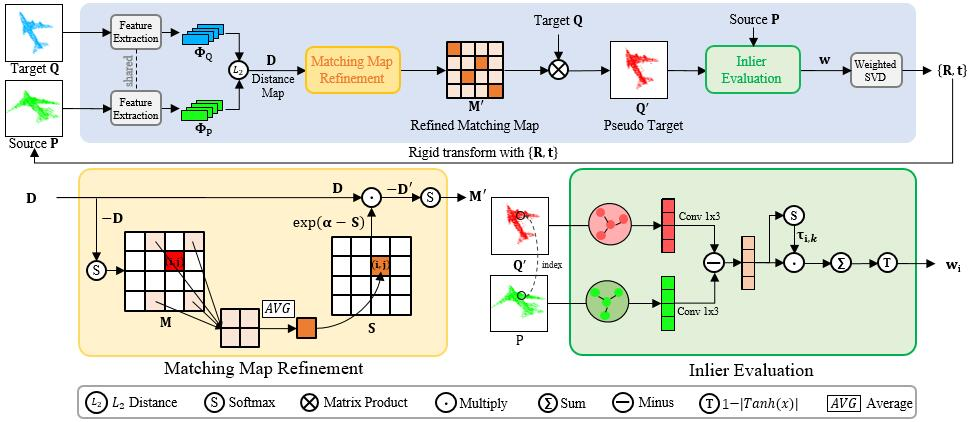

# Reliable Inlier Evaluation for Unsupervised Point Cloud Registration

by Yaqi Shen, Le Hui, Haobo Jiang, Jin Xie and Jian Yang, details are in [paper](https://arxiv.org/pdf/2202.11292.pdf).

### Introduction

This repository contains the source code and pre-trained models for RIENet (published on AAAI 2022).



### Usage

1. Requirement:

   - Hardware: GeForce_RTX_2080_Ti
   - Software: PyTorch>=1.7.1, Python3, CUDA>=11.0, scipy>=1.5.4, tensorboardX, h5py, tqdm, easydict, yaml, sklearn, plyfile, [MinkowskiEngine>=0.5](https://github.com/NVIDIA/MinkowskiEngine)

2. Clone the repository and build the ops:

   ```
   git clone https://github.com/supersyq/RIENet.git
   cd RIENet
   cd pointnet2 && python setup.py install && cd ../
   ```
3. Datasets

   (1) [ModelNet40](https://shapenet.cs.stanford.edu/media/modelnet40_ply_hdf5_2048.zip)

   (2) [7Scenes](https://drive.google.com/file/d/1XdQ3muo5anFA28ZFch06z_iTEjXxLEQi/view?usp=sharing)
   ```
   7scene
   ├── 7-scenes-chess
   │   ├── cloud_bin_0.info.txt
   │   ├── cloud_bin_0.ply
   |   ├── ...
   ├── 7-scenes-fire
   ├── ...
   ```

   (3) [ICL-NUIM](https://drive.google.com/drive/folders/1Wb0gQf-9_9zmUawxl3cGwG9rDSjTDojK)
   
   (4) [KITTI](http://www.cvlibs.net/datasets/kitti/eval_odometry.php)
    ```
    sequences
    ├── 00
    │   ├── velodyne
    │   ├── calib.txt
    ├── 01
    ├── ...
    ```

4. Train:

   - Modify the 'data_file_test', 'data_file', 'gaussian_noise', 'dataset-path', 'root', '' specified in folder 'config' and then do training:

     ```
     CUDA_VISIBLE_DEVICES=0 python main.py ./config/train.yaml
     CUDA_VISIBLE_DEVICES=0 python main.py ./config/train7.yaml
     CUDA_VISIBLE_DEVICES=0 python main.py ./config/train-icl.yaml
     CUDA_VISIBLE_DEVICES=0 python main.py ./config/train-k.yaml
     ```

5. Test:

   - We provide pretrained models in `./pretrained`, please modify `eval` specified in folder 'config' and then do testing:

     ```
     CUDA_VISIBLE_DEVICES=0 python main.py ./config/train.yaml
     CUDA_VISIBLE_DEVICES=0 python main.py ./config/train7.yaml
     CUDA_VISIBLE_DEVICES=0 python main.py ./config/train-icl.yaml
     CUDA_VISIBLE_DEVICES=0 python main.py ./config/train-k.yaml
     ```

### Citation

If you find the code or trained models useful, please consider citing:

```
@inproceedings{shen2022reliable,
  title={Reliable Inlier Evaluation for Unsupervised Point Cloud Registration},
  author={Shen, Yaqi and Hui, Le and Jiang, Haobo and Xie, Jin and Yang, Jian},
  booktitle={AAAI},
  year={2022}
}
```
